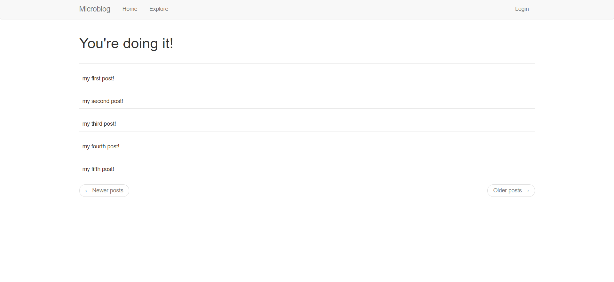

# Wellfound's microblog assessment Solution

DISCLAIMER: This repository was created to host the solution to the Wellfound microblog assessment which was part of a job appliction. If you are not from the Wellfound HR team responsible for the review of this assessment, then please ignore this repository.

## The steps followed to solve this assessment are as follows:

1. Create a virtual environment called env using the virtualenv package. (code: virtualenv env)

2. Activate the environment on my windows device. (code: env\Scripts\activate)

3. Install dependencies from the requirements file. (code: pip install -r requirements.txt)

4. Open the .flaskenv file to find that microblog.py is the entry point of the app.

5. Run flask to get an overview of the app. (code: flask run)

6. Open the app in a browser and browse through it.

7. Browse the app file structure to understand the different components of the app.

8. I found that in /app/main/routes.py, the index() function handles the home page and it sends the post list to index.html.

9. Modify the index.html file to display all posts in the posts list.

10. Add env directory to .gitignore

11. Change remote origin url to point to my repo. (code: git remote set-url origin https://github.com/okayed1998/wellfound_blog.git)

12. Add modification to git. (code: git add .)

13. Commit modifications. (code: git commit -m "Solve Assesment. State of the art commit message 😉").

14. Push to origin. (code: git push -u origin main)

## Changes made to the "index.html" file are:

1. Surround the <tr> element with a for loop block using the proper jinja syntax.

2. Modify the span id to use the user_id attribute of each post using the proper jinja syntax.

3. Modify the inner html of the span to display the body of each post using the proper jinja syntax.

## Sample of the code is shown below:


    <tr>
        <td>
             
            {{ post.body }}
        </td>
    </tr>


## A screenshot of the homepage is shown below.

